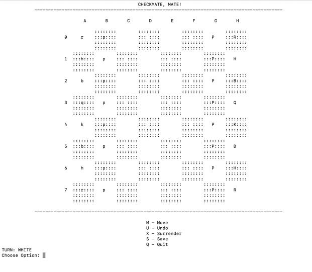
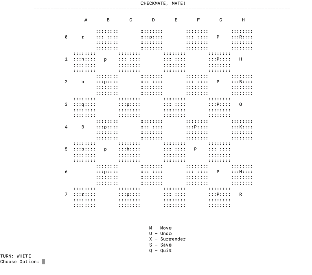

 # Checkmate, Mate!
 
 > Authors: [Ashley Bautista](https://github.com/ashley-bautista),
  [Rodrigo Lamas](https://github.com/lb-rodrigo),
  [Bobby Lerias](https://github.com/bobbyyy57)
 
## Project Description
**Importance/Interesting**:
 * All watching The Queen’s Gambit, out of the list of ideas in the project description, the Chess Game easily caught all of our attention. How complex and yet-so simple chess is, the possibilities of what we can do as a team drove us to choose this project. Even though each of us have had experience playing chess, the game itself and the world that possess it is so foreign. We saw an opportunity to dive deep into chess and understand its complexities all while applying technical skills we have obtained in class. 

**Languages/Tool**s:
 * *C++*
 * *VSCode*: source-code editor made by Microsoft for Linux, Windows, and macOS.
 * *Repl.It*: online IDE that stands for “read--evaluate--print loop”.
 
**Input/Output**:
 * *Input*:
   * user's moves
   * 'Q' = 'quit'
   * 'P' = 'play'
   * 'U' = 'undo'
   * 'S' = 'save'
   * 'X' = 'surrender'
   * 'M' = 'move'
 * *Output*:
   * the pieces moving from one spot (node) to another by either a user.
   * quits the game
   * undo player's move
   * saves game and will allow player(s) to return to game
 
**Design Patterns**:
 * *Strategy Pattern*: This design pattern is a useful pattern in which we can change class behavior or algorithm at run time. In this pattern, we are meant to create an object whose behavior is dependent on the strategy it is applied to. There are several different objects representing these strategies. In our project in particular, we have seven different strategies, each representing the different types of buttons the user will have access to. This design allows us to organize our buttons according to the user's input. 
 * *Factory Method Pattern*: This design pattern allows us to design an interface that will create objects in a superclass that allows subclasses to alter the type that will be created. We will find this pattern useful for the implementation of our Piece class. The Creator will be the Piece Factory in which will have several derived factories for each type of chess piece serving as the Concrete Creators. The Product will be the Piece class itself in which will have several derived classes as well that will determine if the move is valid or not. These classes will be the Concrete Products. This design will allow us better organization or our various Piece class. 

## Class Diagram
 *Strategy Design Pattern*: The functionality of the strategy design pattern shines by allowing us to define a family of algorithms, putting each of them into a separate class while make their objects interchangeable at run time. This is very beneficial as we are able to use pure virtual functions to define algorithms while we allow each indivdual button to implement their algorithm.

 *Factory Method Pattern*: The functionality of the abstract factory pattern can be portrayed by its ability to create objects without having to specify the exact class ofthe object that will be created. This allows us to explicitly declare interfaces for each distinct product of the Piece family without having them to specifically be dependent on the buiness logic of the interface.

## Using the Program
 * *Welcome*: Shown in the image below is our welcome message, which is output at the very beginning of our chess game. 

 * *Beginning Menu*: Once the user hits enter after the welcome message, the previous screen is cleared and they are led to a screen outputting our logo and beginning menu where they can choose to play, quit, or load a previous game.

 * *Board*: If the user chooses ‘P’ or ‘p’, they are led to this screen where they begin their 2-player chess game. Along with the board, they are given a game menu to choose whether they want to move a piece(M), surrender(S), undo a move(U), save the game(S), or quit the game(Q).
 
 * White* chess pieces are denoted by the left side of the board(lower case letters) and the left is the black chess pieces(upper case letters). Initial by either side can only be constituded by moving the pawns forward. Only a pawn's initial move allows it to move two spaces forward. Pieces behind the pawns are not allow make their first moves until there is an opening for them to move without touching/colliding with pieces of the same color. Pieces of the same color cannot eat each other nor can a piece not move position once selected.

 * *Game Play*: This image displays an output shown in the middle of a match between the 2 players. Moves are broken down into two string, selecting the piece by its column and row in that order. Second string is the destination also denoted by a string of the column and row in that order. Pawns may only move forward. Bishops can only move diagonally. Rooks can move up, down and sideways but not diagonally. Knights move in an "L" and are the only one which can move even if its path is not cleared.  Once either player manages to eat their enemenie's king the game is over and playe with the king that still stands is the winner. The queen can move in any direction she was as far as she want. Lastly the king can move on position at a time but in any direction.
 

 * *Quit*: Once the user hits ‘Q’ or ‘q’, they are led to this goodbye message and the game quits.

